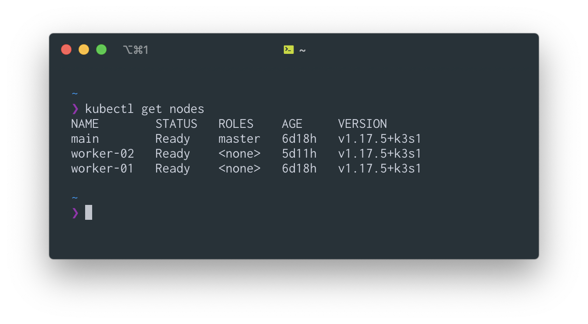

rpi-cluster
================

-   [👨‍💻 Motivation](#motivation)
-   [🧰 Hardware](#hardware)
-   [🔬 Setting up the microSD card](#setting-up-the-microsd-card)
-   [🥾 Setting up USB boot](#setting-up-usb-boot)
-   [👩‍🍳 Changing the hostname](#changing-the-hostname)
-   [👤 Change user](#change-user)
-   [🔑 Set up `.pub` key
    authentication](#set-up-.pub-key-authentication)
-   [📁 SSH config file](#ssh-config-file)
-   [🚀 Setting up k3s](#setting-up-k3s)
-   [📈 Setting up monitoring tools](#setting-up-monitoring-tools)
-   [👨‍🏫 Things I learned](#things-i-learned)

<!-- README.md is generated from README.Rmd. Please edit that file -->

## 👨‍💻 Motivation

The Pi cluster is a hobby project I work on in my spare time. My primary
motivation is to learn, but it’s also just fun. In particular, I would
like to learn:

-   Kubernetes
-   Linux stuff
-   Scaling shiny

## 🧰 Hardware

-   MacBook Pro 2019 16" laptop to work with the Pi
-   3 Raspberry Pi’s, 8GB model
-   1 MicroSD card
-   3 USB &gt;= 3.0
-   1 Network switch with 4 PoE ports
-   3 PoE hats
-   3 CAT6 cables
-   1 Cluster case that has 3 layers

## 🔬 Setting up the microSD card

First step is to configure a microSD card that’s running Raspberry Pi
OS. I wont go into detail on how that part is done, check the official
imaging tools, it’s a simple process. Additionally, **I am not using
WiFi at all**, so I skip steps like setting up the `wpa_supplicant.conf`
file.

Anyway, after you’ve written the Pi OS to a microSD card enable SSH:

``` bash
touch /Volumes/boot/ssh
```

Now unmount the drive, insert it into the Pi and turn it on! If all goes
as planned, you can find your Pi’s IP with `nmap`:

``` bash
nmap -sn 192.168.1.0/24 # ip may very, check what your ip is
```

You should see something like “raspberrypi”, identify the IP associated
with this and SSH into the device. From here, we can update the EEPROM:

``` bash
# pw: raspberry
ssh pi@<IP found in above step>

# upgrade eeprom and reboot
sudo apt-get upgrade -y
sudo rpi-eeprom-update -a
sudo reboot
```

**This next step may not be applicable to others** but this was the key
to get my Pi’s booting from USB (I think, trial and error makes it all
this fuzzy). We need to modify the boot order of the Pi’s, I discovered
this bit of information from:

-   <https://jamesachambers.com/new-raspberry-pi-4-bootloader-usb-network-boot-guide/>

SSH back in the Pi and run:

``` bash
# verify that the BOOT_ORDER=0x1 line is changed to BOOT_ORDER=0x4
sudo -E rpi-eeprom-config --edit

# then reboot
sudo reboot
```

SSH back in the Pi and shut it down for now:

``` bash
sudo shutdown -h now
```

We are ready to set up the USB boot!

## 🥾 Setting up USB boot

Just as the imager tool was used with the microSD, do the same but with
Ubuntu Server 20.10 on a USB device. Once this completes, we need to
edit some files, I discovered this information from:

-   <https://github.com/DavidUnboxed/Ubuntu-20.04-WiFi-RaspberyPi4B>

We need to edit:

1.  `user-data`
2.  `network-config`

You can reference the repository above, or just reference the code
below. For `network-config` we need something like:

``` bash
version: 2
ethernets:
  eth0:
    # Rename the built-in ethernet device to "eth0"
    match:
      driver: bcmgenet smsc95xx lan78xx
    set-name: eth0
    dhcp4: true
    optional: true
```

For `user-data` we need something like:

``` bash
#cloud-config

chpasswd:
  expire: true
  list:
  - ubuntu:ubuntu

ssh_pwauth: true

power_state:
  mode: reboot
```

If I remember correctly, the `power_state` part was needed to get WiFi
working, and I ditched using WiFi entirely, so it may not be needed
anymore (assuming you are going ethernet only route).

Now, with the Pi shutdown and disconnected from power, insert the USB
and remove the microSD. Turn on the Pi and it should boot from USB now.
Repeat this process for all Pi’s.

## 👩‍🍳 Changing the hostname

For all my Pi’s, I want clear hostnames to organize my cluster. I went
with the following naming:

1.  main
2.  worker-01
3.  worker-02

To do this, SSH in the Pi and run:

``` bash
sudo hostnamectl set-hostname <desired hostname>
```

Now reboot the device with `sudo reboot`. Repeat all the stuff with the
other Pi’s.

## 👤 Change user

The default user is `ubuntu` but I want to change it. In my case, I have
a user `pirate` for all Pi’s. To do this, I ran:

``` bash
# check groups of ubuntu
groups

# add a user
sudo adduser pirate

# set groups for pirate (i found these groups by running `groups` as you see above)
sudo usermod -a -G adm,dialout,cdrom,floppy,sudo,audio,dip,video,plugdev,netdev,lxd pirate
```

Log out of the Pi with `exit` and try to log in with your new username.
If you can login with out issue, delete the `ubuntu` user:

``` bash
sudo deluser --remove-home ubuntu
```

## 🔑 Set up `.pub` key authentication

I think there are multiple ways you can set up key based authentication,
there is a `.pem` and `.pub` file, I’m not sure which is better or what
the difference is but I’m using `.pub`. This allows your to SSH into the
Pi’s without entering passwords and has a number of other benefits like
allowing Ansible to control your Pi cluster. To do this, I start by
making a key if you don’t already have one:

``` bash
ssh-keygen -t rsa -b 4096 -C "tyler@rpi" # put whatever comment you want
```

Now copy the key to each Pi:

``` bash
ssh-copy-id -i ~/.ssh/id_rsa.pub pirate@<ip>
```

Next time you SSH, no password should be required.

## 📁 SSH config file

Set up a `config` file in `~/.ssh/` directory to you can assign a name
to each connection:

``` bash
nano ~/.ssh/config
```

Then add something like:

``` bash
Host rpi-main
  User pirate
  HostName <ip>

Host rpi-worker-01
  User pirate
  HostName <ip>

Host rpi-worker-02
  User pirate
  HostName <ip>
```

Now you can SSH into the Pi’s with `ssh rpi-main`.

## 🚀 Setting up k3s

I basically followed this:

-   <https://www.jeffgeerling.com/blog/2020/installing-k3s-kubernetes-on-turing-pi-raspberry-pi-cluster-episode-3>

I clone the k3s-ansible project to this repo and removed some stuff I
didn’t need, things like the README, and then:

1.  Edit `inventory/hosts.ini`, add node IPs.
2.  Edit `inventory/group_vars/all.yml` and change the `ansible_user` to
    pirate.
3.  Run
    `ansible-playbook site.yml -i inventory/hosts.ini --ask-become-pass`

Now grab the kube config file with:

``` bash
scp pirate@main:~/.kube/config ~/.kube/config-rpi
```

If `kubectl` isn’t installed, `brew install kubectl`. Set the
`KUBECONFIG` environment variable with:

``` bash
export KUBECONFIG=~/.kube/config-rpi
```

If you want this to be permanent, put it in your `~/.zshrc` file. After
all of this, you should be able to fetch all nodes with
`kubectl get nodes`.



Note, that I think the `--ask-become-pass` part is not supposed to be
necessary. I may have configured things wrong, but adding it allows this
playbook to complete.

## 📈 Setting up monitoring tools

I basically followed this:

-   <https://www.jeffgeerling.com/blog/2020/raspberry-pi-cluster-episode-4-minecraft-pi-hole-grafana-and-more>

And used
[`carlosedp/cluster-monitoring`](https://github.com/carlosedp/cluster-monitoring)
to easily set up monitoring for the Pis. I cloned this repository to my
main node and followed the [k3s
instructions](https://github.com/carlosedp/cluster-monitoring#quickstart-for-k3s).

## 👨‍🏫 Things I learned

-   **I struggled with WiFi on the Pi’s and in the end decided it wasn’t
    worth the effort.** After trial and error, and learning about
    `power_state` in the cloud-config, I could get WiFi working on USB
    but it wasn’t reliable. For example, setting up k3s via Ansible
    would constantly error out. However, the Ansible playbook *just
    worked* after switching to ethernet.

-   **I struggled with
    [cloud-config](https://cloudinit.readthedocs.io/en/latest/topics/examples.html),
    but I want to revisit.** In this guide, I have some steps where I
    set the hostname, copy the SSH key, create a different user, and
    more. All of this can be handled in the cloud-config file on the
    first boot of the Pi, but I couldn’t get it working. For example, I
    couldn’t get `hostname` or `ssh_authorized_keys` to work.
